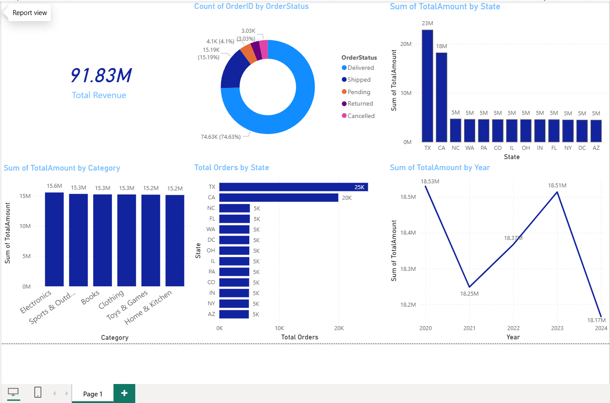

# Amazon Sales Dashboard

## Project Overview
This project presents an interactive Power BI dashboard developed using the Amazon Sales dataset. The dashboard provides insights into sales performance, order status, product categories, regional sales distribution, and yearly revenue trends.

## Tools Used
- Power BI
- Power Query
- DAX

## Dashboard Features
- Total Revenue KPI
- Revenue by Category
- Revenue by State
- Order Status Distribution
- Total Orders by State
- Yearly Revenue Trends

## Key Insights
- Total Revenue: 91.83M
- Texas generated the highest revenue.
- California generated the second-highest revenue.
- Delivered orders accounted for the majority of orders.
- Electronics category contributed the highest sales revenue.

## Dashboard Preview

## Files Included
- amazon_sales_dashboard.pbix
- Amazon.csv
- dashboard.png

## Skills Demonstrated
- Data Analysis
- Data Visualization
- Power BI
- Dashboard Design
- Business Intelligence
